# PromptCraft Architecture

## System Overview

PromptCraft is a serverless AI-powered prompt generator built entirely on AWS, leveraging Bedrock for intelligent prompt enhancement.

## Architecture Diagram

```mermaid
graph TB
    subgraph "User Layer"
        User[👤 User Browser]
        Domain[🌐 promtcraft.in]
    end

    subgraph "CDN & Static Hosting"
        CF[☁️ CloudFront<br/>E35H3XC092ZZDB<br/>Global Edge Caching]
        S3[📦 S3 Bucket<br/>ai-prompt-generator-production<br/>Static Website Hosting]
        ACM[🔒 ACM Certificate<br/>SSL/TLS]
    end

    subgraph "API Layer"
        APIGW[🚪 API Gateway<br/>REST API<br/>/prod/generate-prompt]
    end

    subgraph "Compute Layer"
        Lambda[⚡ Lambda Function<br/>ai-prompt-generator-production<br/>Node.js 20.x | 512MB | 30s timeout]
        IAM[🔑 IAM Role<br/>ai-prompt-generator-lambda-role]
    end

    subgraph "AI Layer"
        Bedrock[🤖 AWS Bedrock<br/>Claude 3 Haiku<br/>$0.25/M input tokens<br/>$1.25/M output tokens]
        Models[📚 Available Models<br/>• Claude 3 Haiku ✅<br/>• Claude 3.5 Haiku ✅<br/>• Claude 3 Sonnet<br/>• Claude 3 Opus]
    end

    subgraph "Data Layer"
        DDB1[💾 DynamoDB<br/>promtcraft-production-prompts<br/>Prompt History & Analytics]
        DDB2[🛡️ DynamoDB<br/>promtcraft-production-ratelimit<br/>Rate Limiting & Abuse Prevention]
    end

    subgraph "Monitoring & Security"
        CW[📊 CloudWatch Logs<br/>Lambda Execution Logs<br/>API Access Logs]
        Marketplace[🏪 AWS Marketplace<br/>Model Subscriptions]
    end

    User -->|HTTPS| Domain
    Domain -->|DNS| CF
    CF -->|Cache Miss| S3
    CF -->|Cached Content| User
    ACM -.->|SSL/TLS| CF
    S3 -->|HTML/CSS/JS| CF
    
    User -->|API Request| APIGW
    APIGW -->|Invoke| Lambda
    IAM -.->|Permissions| Lambda
    Lambda -->|Invoke Model| Bedrock
    Bedrock -->|AI Response| Lambda
    Models -.->|Selected Model| Bedrock
    
    Lambda -->|Store Prompt| DDB1
    Lambda -->|Check Rate Limit| DDB2
    Lambda -->|Rate Limit Response| APIGW
    Lambda -->|Enhanced Prompt| APIGW
    APIGW -->|JSON Response| User
    
    Lambda -.->|Logs| CW
    IAM -.->|Bedrock Access| Marketplace
    
    style User fill:#e1f5ff
    style CF fill:#ff9900
    style S3 fill:#569a31
    style APIGW fill:#ff4f8b
    style Lambda fill:#ff9900
    style Bedrock fill:#8b5cf6
    style DDB1 fill:#4053d6
    style DDB2 fill:#4053d6
    style IAM fill:#dd344c
    style CW fill:#ff9900
```

## Data Flow

### 1. Static Content Delivery
```
User → promtcraft.in → CloudFront (Edge Cache) → S3 Bucket → HTML/CSS/JS
```

### 2. AI Prompt Generation Flow


## Component Details

### Frontend (S3 + CloudFront)
- **Technology**: Pure HTML, CSS, JavaScript (no build process)
- **Hosting**: S3 static website hosting
- **CDN**: CloudFront with global edge locations
- **SSL**: ACM certificate for HTTPS
- **SEO**: Optimized meta tags, sitemap, structured data (JSON-LD)

### API Gateway
- **Type**: REST API
- **Endpoint**: `https://njzzp0serg.execute-api.us-east-1.amazonaws.com/prod/generate-prompt`
- **Methods**: POST
- **CORS**: Enabled for promtcraft.in
- **Throttling**: AWS default (10,000 requests/second)

### Lambda Function
- **Runtime**: Node.js 20.x
- **Memory**: 512 MB
- **Timeout**: 30 seconds
- **Handler**: index.handler
- **Layers**: None (dependencies in deployment package)
- **Environment Variables**:
  - `PROMPTS_TABLE`: promtcraft-production-prompts
  - `RATE_LIMIT_TABLE`: promtcraft-production-ratelimit

### AWS Bedrock Integration
- **Model**: Claude 3 Haiku (us.anthropic.claude-3-haiku-20240307-v1:0)
- **Type**: Inference Profile (cross-region availability)
- **Authentication**: IAM role (no API keys needed)
- **Cost per Request**: ~$0.0004 (very affordable)
- **Permissions**:
  - `bedrock:InvokeModel`
  - `bedrock:InvokeModelWithResponseStream`
  - `aws-marketplace:ViewSubscriptions`

### DynamoDB Tables

#### promtcraft-production-prompts
- **Purpose**: Store prompts and analytics
- **Partition Key**: id (UUID)
- **Attributes**: originalPrompt, enhancedPrompt, timestamp, metadata
- **Billing**: On-Demand (pay per request)

#### promtcraft-production-ratelimit
- **Purpose**: Rate limiting and abuse prevention
- **Partition Key**: ipAddress
- **TTL**: Enabled (automatic cleanup)
- **Rate Limit**: 10 requests per minute per IP
- **Billing**: On-Demand (pay per request)

### IAM Role Permissions
```json
{
  "DynamoDB": ["PutItem", "GetItem", "Query"],
  "Bedrock": ["InvokeModel", "InvokeModelWithResponseStream"],
  "Marketplace": ["ViewSubscriptions", "Subscribe"],
  "CloudWatch": ["PutLogEvents", "CreateLogStream"]
}
```

## Cost Analysis

### Monthly Cost Breakdown (per 1,000 users)

| Service | Usage | Cost | Notes |
|---------|-------|------|-------|
| **Bedrock** | 10,000 requests × 300 tokens | $3.75 | Primary cost driver |
| **Lambda** | 10,000 invocations × 2s avg | $0.50 | Compute + requests |
| **DynamoDB** | 20,000 writes + 10,000 reads | $0.50 | On-demand pricing |
| **API Gateway** | 10,000 API calls | $0.04 | REST API requests |
| **S3** | 50 GB transfer + storage | $2.00 | Static hosting |
| **CloudFront** | 50 GB data transfer | $4.25 | CDN delivery |
| **CloudWatch** | Log storage and queries | $0.50 | Monitoring |
| **Total** | | **$11.54** | For 10K API requests/month |

### Cost Per Request
- **AI Generation**: $0.000375 (Bedrock)
- **Infrastructure**: $0.000075 (Lambda + DynamoDB + API Gateway)
- **CDN/Static**: $0.000085 (S3 + CloudFront)
- **Total**: **~$0.000535** per enhanced prompt

## Scalability

### Current Limits
- **Lambda Concurrent Executions**: 1,000 (default)
- **API Gateway**: 10,000 requests/second
- **Bedrock**: 10,000 tokens/minute (can request increase)
- **DynamoDB**: Unlimited (on-demand mode)

### Expected Performance
- **Response Time**: 800ms - 2s (95th percentile)
- **Cold Start**: ~500ms (Node.js 20.x)
- **Warm Request**: ~800ms (Bedrock latency)

### Traffic Handling
| Traffic Level | Requests/Month | Monthly Cost | Notes |
|---------------|----------------|--------------|-------|
| Low | 1,000 | $1.50 | Mostly free tier |
| Medium | 10,000 | $11.54 | As calculated above |
| High | 100,000 | $110.00 | Linear scaling |
| Very High | 1,000,000 | $1,050.00 | Consider reserved capacity |

## Security Features

### ✅ Implemented
- **HTTPS Only**: ACM certificate + CloudFront
- **Rate Limiting**: 10 requests/min per IP (DynamoDB-based)
- **CORS**: Restricted to promtcraft.in domain
- **IAM Roles**: No hardcoded credentials
- **Input Validation**: Prompt length limits (10-2000 chars)
- **CloudWatch Monitoring**: All logs retained
- **DynamoDB Encryption**: At-rest encryption enabled
- **No API Keys**: Bedrock uses IAM authentication

### 🔒 Additional Recommendations
- **AWS WAF**: Add web application firewall ($5/month)
- **Billing Alarms**: Set up cost alerts (already configured)
- **CloudTrail**: Enable audit logging
- **VPC**: Consider VPC for Lambda (if needed)

## Disaster Recovery

### Backups
- **DynamoDB**: Point-in-time recovery available
- **S3**: Versioning enabled
- **Lambda Code**: Stored in GitHub + S3
- **Infrastructure**: CloudFormation templates ready

### Rollback Strategy
1. **Frontend**: CloudFront invalidation to previous S3 version
2. **Backend**: Lambda alias with traffic shifting
3. **AI Model**: Fallback to template-based system (index-templates-backup.js)

### Recovery Time Objective (RTO)
- **Frontend Issues**: < 5 minutes (CloudFront invalidation)
- **Backend Issues**: < 10 minutes (Lambda code rollback)
- **Complete Outage**: < 30 minutes (redeploy via GitHub)

## Monitoring & Alerts

### CloudWatch Metrics
- Lambda invocations, errors, duration
- API Gateway 4xx/5xx errors, latency
- DynamoDB throttles, consumed capacity
- Bedrock invocation errors

### Alarms (Recommended)
- Lambda error rate > 1%
- API Gateway 5xx rate > 5%
- Monthly cost > $20
- DynamoDB throttling events

## Development Workflow

```mermaid
graph LR
    Dev[👨‍�💻 Developer] -->|Code| Git[📝 GitHub]
    Git -->|Push| CI[🔄 Manual Deploy]
    CI -->|Upload| S3F[📦 S3 Frontend]
    CI -->|Deploy| Lambda[⚡ Lambda]
    Lambda -->|Test| Prod[🌐 Production]
    
    style Dev fill:#e1f5ff
    style Git fill:#f0f0f0
    style CI fill:#4caf50
    style Prod fill:#ff9900
```



### Deployment Steps
1. Test locally: `npm test`
2. Update Lambda: `cd lambda && zip -r lambda.zip . && aws lambda update-function-code...`
3. Update Frontend: `aws s3 sync frontend/ s3://bucket/`
4. Invalidate CDN: `aws cloudfront create-invalidation...`
5. Verify: Test live site at promtcraft.in

## Future Enhancements

### Planned Features
- [ ] User accounts (Cognito)
- [ ] Saved prompts (per-user DynamoDB GSI)
- [ ] Prompt templates library
- [ ] Multi-language support
- [ ] A/B testing (Claude models comparison)
- [ ] Analytics dashboard
- [ ] Browser extension

### Infrastructure Improvements
- [ ] Multi-region deployment
- [ ] CloudFormation automation (Infrastructure as Code)
- [ ] CI/CD pipeline (GitHub Actions)
- [ ] Blue-green deployments
- [ ] Canary releases
- [ ] Auto-scaling based on traffic

---

## Quick Links

- **Live Site**: https://promtcraft.in
- **API Endpoint**: https://njzzp0serg.execute-api.us-east-1.amazonaws.com/prod/generate-prompt
- **GitHub**: https://github.com/abhiram-gannavaram/promptcraft
- **AWS Console**: us-east-1 region

## Tech Stack Summary

| Layer | Technology | Purpose |
|-------|-----------|---------|
| Frontend | HTML/CSS/JS | User interface |
| CDN | CloudFront | Global content delivery |
| Storage | S3 | Static website hosting |
| API | API Gateway | REST endpoint |
| Compute | Lambda | Serverless functions |
| AI | Bedrock (Claude) | Prompt enhancement |
| Database | DynamoDB | Prompts + rate limiting |
| Security | IAM + ACM | Authentication + SSL |
| Monitoring | CloudWatch | Logs + metrics |
| DNS | Route 53 | Domain management |

**Architecture Pattern**: Serverless + JAMstack  
**Deployment Model**: Fully managed AWS services  
**Cost Model**: Pay-as-you-go, scales to zero  
**Availability**: Multi-AZ (AWS default)
